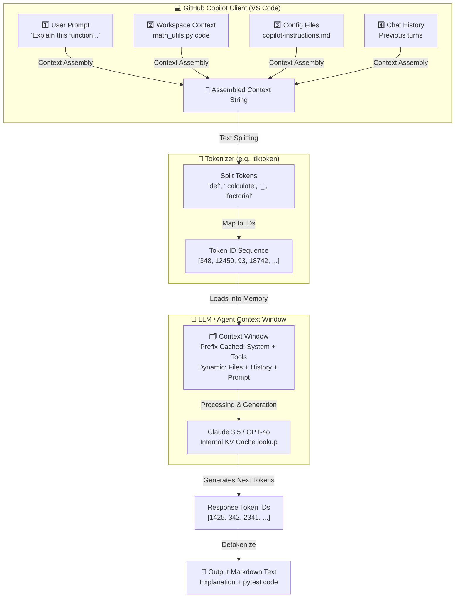

## Overview

Have you ever wondered what actually happens when you highlight a block of code in your editor, open a chat window, and type: *"Explain this function and write a unit test"*?

How does a stateless Large Language Model (LLM) know which files are open, what tools are at its disposal, or what you asked it two minutes ago? And, perhaps most importantly, how are these interactions structured under the hood, and how do they impact your API costs and response times?

To write efficient prompts and understand the cost structure of modern AI coding assistants and agents, we need to look under the hood at three core concepts: **prompts**, **context assembly**, and **tokenization**.

---

## The Core Concepts: Prompts vs. Context

To understand how Large Language Models (LLMs) and AI agents operate, it is essential to distinguish between the input you provide and the actual text sent to the model.

### What is a Prompt?
A **prompt** is the raw, direct input or query provided by you, the developer. For instance, typing `Explain this function and write a unit test` in a chat interface or selecting code and asking for a refactor. It represents your explicit intent.

### How Prompts Become Context (Context Assembly)
LLMs are inherently stateless. When you send a message, the model does not automatically know about the files in your workspace, your terminal output, or even your previous chat messages. 

To provide a helpful, context-aware answer, the AI application (such as GitHub Copilot or an IDE agent) must collect and assemble all relevant information before sending it to the model. This process is called **Context Assembly**.

The assembled **Context** is a single, unified text package containing:
1. **System Instructions**: The model's core persona, behavioral constraints, and formatting rules.
2. **Instruction Files**: Local guidance files like `.github/copilot-instructions.md` or `AGENTS.md`.
3. **Workspace Context (Files & RAG)**: Active file contents, open editor tabs, relevant code symbols, search results, or repository structure.
4. **Tool Definitions**: Schemas of tools the agent can execute (e.g., search, file modification, shell commands).
5. **Conversation History**: Previous user messages and model responses to preserve discussion state.
6. **User Input Prompt**: The latest request typed by the user, placed at the very end of the context.

---

## Behind the Scenes: Context Assembly in GitHub Copilot

Let's look at a concrete example of how a developer request in GitHub Copilot is assembled, tokenized, and processed.

### The Developer's Scenario
Imagine you have opened `math_utils.py` in VS Code, which contains:

```python
def calculate_factorial(n):
    if n == 0:
        return 1
    return n * calculate_factorial(n-1)
```

In the Copilot Chat window, you submit the prompt:
> *"Explain this function and write a unit test."*

### 1. Assembling the Context
Before the request reaches the LLM, the GitHub Copilot client gathers context and constructs the following unified payload:

```yaml
# [System Instructions]
You are GitHub Copilot, an AI programming assistant. Answer queries concisely.
Return code blocks with language specifiers.

# [Local Instructions - .github/copilot-instructions.md]
- Always write docstrings for Python functions.
- Use pytest for unit testing.

# [Workspace Context: math_utils.py]
def calculate_factorial(n):
    if n == 0:
        return 1
    return n * calculate_factorial(n-1)

# [Conversation History]
(None - first query of the session)

# [User Prompt]
Explain this function and write a unit test.
```

---

## What is a Token Anyway?

The assembled text cannot be processed directly as raw English characters by the LLM. Instead, it is fed into a **Tokenizer** (e.g., *tiktoken* for OpenAI models or the *Llama tokenizer*), which breaks the text into integers representing characters or sub-words called **tokens**.

Here is a visual example of how the code snippet in our context is broken down into tokens and assigned numerical Token ID values:

| Text Fragment | Tokens | Token IDs (Illustrative) | Explanation |
|---|---|---|---|
| `def ` | `["def", " "]` | `[348, 220]` | Python keyword + space |
| `calculate` | `["calculate"]` | `[12450]` | Common English word |
| `_factorial` | `["_", "factorial"]` | `[93, 18742]` | Underscore and suffix word |
| `(n):` | `["( ", "n", " )", ":"]` | `[9, 81, 10, 27]` | Parameter and syntax punctuation |

The user's raw prompt is similarly tokenized:
* **Raw Prompt:** `"Explain this function and write a unit test."`
* **Tokens:** `["Explain", " this", " function", " and", " write", " a", " unit", " test", "."]`
* **Token IDs:** `[34902, 436, 1724, 290, 3556, 257, 3601, 1234, 13]`

---

## The Context Window: A Cost and Latency Breakdown

Below is a realistic token count breakdown of this compiled context as it is sent to the LLM (e.g., GPT-4o or Claude 3.5 Sonnet):

| # | Component | Example Content / Purpose | Est. Tokens | % of Context | Cached? |
|---|---|---|---|---|---|
| 1 | **System Instructions** | Copilot developer persona and safety guidelines | ~1,200 | 18.5% | ✅ Yes |
| 2 | **Instruction Files** | `.github/copilot-instructions.md` configuration | ~800 | 12.3% | ✅ Yes |
| 3 | **Tool Definitions** | Copilot Workspace Agent capabilities (file read/write, terminal) | ~2,500 | 38.5% | ✅ Yes |
| 4 | **Workspace Context** | Content of active file `math_utils.py` and editor environment | ~450 | 6.9% | ❌ Dynamic |
| 5 | **Conversation History** | Prior chat turns (empty in first turn, grows as session continues) | ~1,500 | 23.1% | ❌ Dynamic |
| 6 | **Input Prompt** | Current request: *"Explain this function..."* | ~50 | 0.7% | ❌ Dynamic |
| | **Total Assembled Context** | | **~6,500** | **100%** | |

> 💡 **Cost & Latency Optimization Note:**
> Items 1, 2, and 3 (~4,500 tokens) form the static prefix. The LLM provider (e.g., OpenAI or Anthropic) caches the key-value tensors (KV Cache) of this prefix. Subsequent user messages reuse this cache, saving over 50% in latency and lowering input token billing significantly.

---

## Visualizing the Flow: From Prompt to Response

Below is a conceptual layout of the pipeline.



---

## How AI Agents Spend Tokens

In an agentic coding session, each request you send to the model includes system instructions, tool definitions, repository context, and the ongoing conversation history. This repeated beginning is called the **prompt prefix**.

### The Prompt Prefix and Caching
For example, if you run a code-review task on two different Python files in the same session, both requests will share the exact same system instructions, tool definitions, and review guidelines. 

If two requests share the exact same prefix, the model doesn’t need to start from scratch each time. Instead, it can reuse a cached version of the work it already did. But don’t imagine this cache as a simple text copy. What’s stored is the model’s internal state—represented as key/value tensors—that was built while processing the prefix.

By reusing this cached state, the system saves resources in two ways:
* **Cost efficiency**: Cached tokens can be up to ten times cheaper than recomputing them.
* **Speed**: Latency drops because the model skips redundant work.

### Tool-Definition Overhead and Tool Search
AI agents can access a vast array of tools through Model Context Protocol (MCP) servers, built-in features, and extensions. To use them, the model requires a complete definition for each tool, including its name, description, and JSON parameter schema.

The definitions for the entire toolset are injected into the context window on every turn. Consequently, even if this data is cached, these tool definitions create a fixed overhead that rapidly consumes the available context window as more tools are added.

---

## Advanced Token Efficiency: Caching & On-Demand Search

To combat context bloat, major LLM providers like OpenAI and Anthropic have introduced key optimizations.

### 1. Extended Prompt Caching
Prompt caching is an optimization that reuses repeated prompt segments across API requests.

* **How it works:** Instead of reprocessing identical prompt prefixes for every request, the model stores an internal representation of those tokens and reuses it when the same prefix appears again.
* **OpenAI's Implementation:** Caching is automatic for prompts containing at least 1,024 tokens. Requests are routed based on a hash of the first ~256 tokens. A cache hit can yield up to an **80% reduction in latency** and a **90% savings in input token costs**.
* **Best practice:** Place static content (instructions, tool schemas) at the start of your files or prompt pipelines, and dynamic content (new questions, edits) at the very end.

### 2. On-Demand Tool Search
Instead of giving the AI all tool definitions at once (which consumes tokens and can confuse the model), on-demand tool search acts like a retrieval system.

Think of it as **"RAG (Retrieval-Augmented Generation) for tools."** OpenAI maps this operational logic into a 5-step process:

1. **Indexing:** All functional tool schemas are indexed or flagged for deferred loading.
2. **Bootstrap:** The model initially launches with a singular, specialized tool-search capability.
3. **Discovery:** The model assesses the user query, dynamically queries its internal directory, and locates semantic matches.
4. **Injection:** The discovered tools are injected directly at the end of the context window to preserve prompt caching of the static prefix.
5. **Execution:** The model executes the now-loaded functional tools as normal.

> 📊 **Impact:** Benchmarks show token savings of up to **47%**, while scaling to support many diverse functions without compromising accuracy.

---

## Best Practices for Developers to Save Tokens and Time

1. **Keep Static Assets Clean:** Keep your local instruction files (like `.github/copilot-instructions.md`) concise. Every line adds to the baseline cost of every single query in a session.
2. **Order Matters:** If you are building custom API integrations, always place static information (system instructions, schemas) at the top, and dynamic input (the user's prompt) at the bottom to leverage prompt caching.
3. **Manage Session Length:** While keeping a long chat session active preserves history, it also increases the tokens sent with each new query. If you're switching to a completely new task, start a fresh session to clear out accumulated tokens.

---

## References

| Resource | URL |
|---|---|
| OpenAI Prompt Caching Guide | <https://platform.openai.com/docs/guides/prompt-caching> |
| Anthropic Prompt Caching API | <https://docs.anthropic.com/en/docs/build-with-claude/prompt-caching> |
| VS Code Blog: Improving Token Efficiency | <https://code.visualstudio.com/blogs/2026/06/17/improving-token-efficiency-in-github-copilot> |
| Model Context Protocol (MCP) | <https://modelcontextprotocol.io/> |
